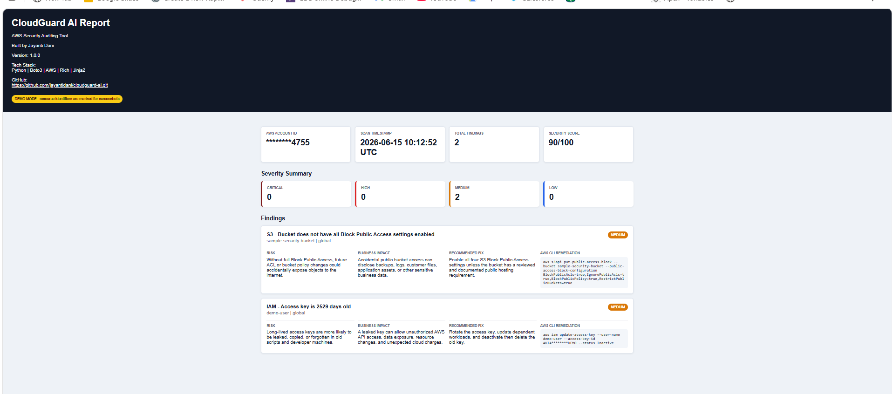

# CloudGuard AI

CloudGuard AI is a read-only Python CLI that scans AWS for common public exposure risks and produces both terminal output and an HTML report.

It currently checks:

- EC2 security groups with internet access to SSH, RDP, MySQL, PostgreSQL, or Redis
- Publicly accessible RDS database instances
- S3 buckets missing one or more Block Public Access settings
- IAM users with AdministratorAccess
- IAM access keys older than 90 days
- Disabled CloudTrail logging

The scanner does not modify AWS resources. Remediation commands are printed as guidance only.

## Features

- Severity summary for `CRITICAL`, `HIGH`, `MEDIUM`, and `LOW`
- Security score that starts at 100 and subtracts by severity
- AWS account ID, scan timestamp, and total findings
- Finding-level risk explanation
- Finding-level business impact
- Recommended fix for each issue
- AWS CLI remediation command for manual follow-up
- Modern responsive HTML dashboard at `reports/cloudguard-report.html`
- Automation-friendly exit codes

## Setup

```powershell
python -m pip install boto3 rich jinja2
$env:PYTHONPATH="src"
python -m cloudguard_ai.cli scan --region us-east-1
```

## Usage

Use your default AWS credentials:

```powershell
cloudguard-ai scan
```

Use a specific AWS profile and region:

```powershell
cloudguard-ai scan --profile my-profile --region us-east-1
```

After each scan, open the generated report:

```powershell
start reports\cloudguard-report.html
```

## Sample Output

```text
Scan Summary
AWS Account ID  123456789012
Scan Timestamp  2026-06-15 08:30:00 UTC
Total Findings  7
Security Score  20/100

Severity Summary
CRITICAL  2
HIGH      3
MEDIUM    2
LOW       0

CloudGuard AI Findings
Service  Resource              Severity  Region     Issue
EC2      web-sg (sg-12345678)  CRITICAL  us-east-1  SSH port 22 is open to the internet: 0.0.0.0/0
RDS      prod-db               HIGH      us-east-1  DB instance is publicly accessible
IAM      deploy-user           CRITICAL  global     IAM user has AdministratorAccess permissions

HTML report written to reports\cloudguard-report.html
```

The full terminal table and HTML report also include risk explanation, business impact, recommended fix, and a manual AWS CLI remediation command for every finding.

## Screenshots

### HTML Dashboard



## Exit Codes

- `0`: Scan completed and no findings were detected
- `1`: Scan completed and one or more findings were detected
- `2`: AWS credentials, profile, region, or API errors prevented a reliable scan

## Required AWS Permissions

CloudGuard AI only needs read permissions for the checks it runs:

- `ec2:DescribeSecurityGroups`
- `rds:DescribeDBInstances`
- `s3:ListAllMyBuckets`
- `s3:GetBucketPublicAccessBlock`
- `iam:ListUsers`
- `iam:ListAttachedUserPolicies`
- `iam:ListUserPolicies`
- `iam:GetUserPolicy`
- `iam:ListAccessKeys`
- `cloudtrail:DescribeTrails`
- `cloudtrail:GetTrailStatus`
- `sts:GetCallerIdentity`

## Future Roadmap

- Unused IAM credential checks
- GuardDuty posture checks
- Security Hub ASFF export
- JSON and CSV report formats
- Multi-region scan mode
- CI/CD policy gate mode
- Optional allowlist for approved public resources
